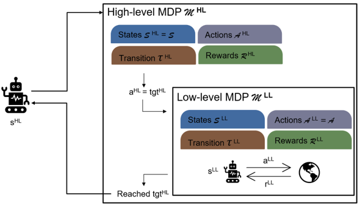

# Bi-level MDPs
This repository accompanies the paper
> S. Banerjee, B. Balaban, M. Shirley, K. Bradner, and M. Pavone, “[Contingency Planning Using Bi-level Markov Decision Processes for Space Missions](https://arxiv.org/abs/2402.16342),” in IEEE Aerospace Conference, 2024.

<p align="center"></p>

## Requirements
- Julia 1.9.0

## Quickstart
Run notebook RoverWorld-BiLevel to start creating your own flat and bi-level MDPs for mission planning:
```
jupyter notebook notebooks/RoverWorld-BiLevel.ipynb
```

Run notebook VizRoverWorld to visualize the MDP solution:
```
jupyter notebook notebooks/VizRoverWorld.ipynb
```

## Citing this work
Please use the following BibTex entry to cite this work.
```
@inproceedings{BanerjeeBalabanEtAl2024,
  author = {Banerjee, S. and Balaban, B. and Shirley, M. and Bradner, K. and Pavone, M.},
  title = {Contingency Planning Using Bi-level Markov Decision Processes for Space Missions},
  booktitle = {{IEEE Aerospace Conference}},
  year = {2024},
  url = {https://arxiv.org/abs/2402.16342}
}
```

## Contact authors
Contact the authors at [somrita@stanford.edu](mailto:somrita@stanford.edu).
